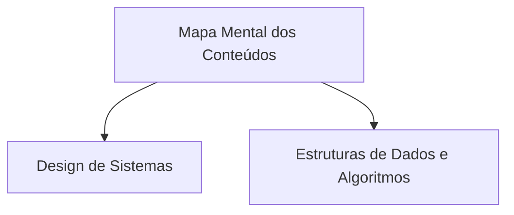

```mermaid
graph TD
  A[Mapa Mental dos Conteúdos]
  B[Design de Sistemas]
  C[Estruturas de Dados e Algoritmos]

  A --> B
  A --> C

  click B "https://github.com/nori-marcos/Coding-Interview/blob/main/System%20Design%20Fundamentals/Design%20de%20Sistemas.md" _blank
  click C "https://github.com/nori-marcos/Coding-Interview/blob/main/Algorithms%20and%20Data%20Structures/Algoritmos%20e%20Estruturas%20de%20Dados.md" _blank
```