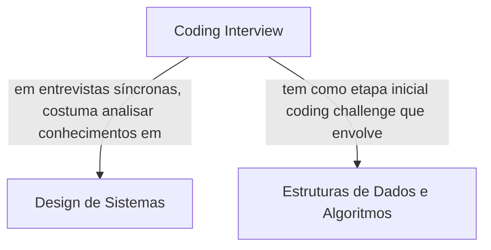

# Coding-Interview

A ideia deste repositório é agrupar conhecimentos que estou adquirindo para me preparar para coding interviews. No momento atual, os seguintes assuntos estão sendo estudados:

- [Design de Sistemas](1%20System%20Design%20Fundamentals/Design%20de%20Sistemas.md)
- [Estruturas de Dados e Algoritmos](2%20Algorithms%20and%20Data%20Structures/Algoritmos%20e%20Estruturas%20de%20Dados.md)

# Mapa Mental

Mapa mental dos conteúdos que estou estudando para coding interviews.

